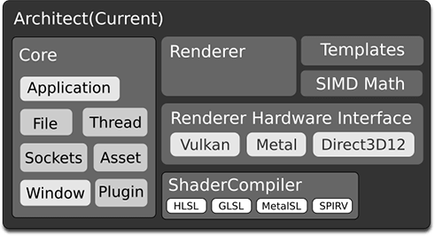
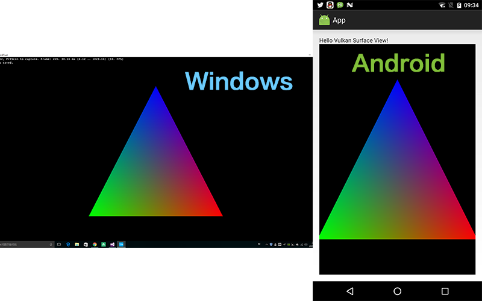
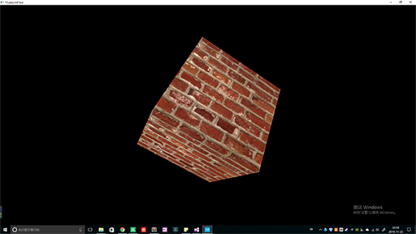
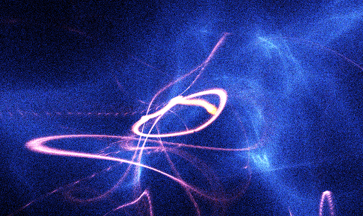

Introduction 
=========

**kaleido3d** is a cross-platform graphics library.

> **Main Feature**
> 
>* `Next Generation Graphics Library` 
>* Modern C++ Code
>* Modern Graphics Renderer (`Metal`, `Vulkan`, `Direct3D 12`, `OpenGL|ES`)
>* **`Maya`** Digital Content Creation Tools
>* **Task-Oriented**, support `multi-thread` rendering 
>* Support Windows, Android, iOS, MacOS & Linux.

----------

Prerequisites
=========


| | Windows | Android | MacOS/iOS |
|:---:|:---:|:---:|:---:|
|CI Status|[](https://ci.appveyor.com/project/TsinStudio/kaleido3d)|[](https://circleci.com/gh/TsinStudio/kaleido3d) |[](https://travis-ci.org/TsinStudio/kaleido3d)|
|IDE| VS2015+ | Android Studio 2.2+| Xcode 8.1+ |
|OS Requirements| Win10 | Android 7.+| MacOS Sierra |
|Dependency| [ThirdParty](https://github.com/Tomicyo/kaleido3d_dep)/CMake 3.4+ | [ThirdParty](https://github.com/Tomicyo/kaleido3d_dep)/NDK r12+/Gradle | [ThirdParty](https://github.com/Tomicyo/kaleido3d_dep)/CMake 3.4+ |

----------

Build Instructions
=========

>* **Windows**: make.bat
>* **Mac OS X**: ./make_macos.sh
>* **Android**: (./)gradlew build

---

Current Status
========

- RHI(Render Hardware Interface)

	* [x] Vulkan backend **ready**.
	* [x] DirectX 12 backend **WIP**
	* [x] Metal backend **WIP**

- Core.Platform

	* [x] Windows implementation ready.
	* [x] Android RendererView.
	* [x] iOS/MacOS **WIP**.

- Tools
	
	* [x] HLSL ShaderCompiler (D3DCompiler & GLSLANG)
	* [x] Maya exporter.

- Planned Samples
	
	* [x] Triangle
	* [x] Textured Cube
	* [x] Compute Shader
	* [ ] Physically Based Shading (Material Model)
	* [ ] Skinned Skeleton Animation
	* [ ] Shadow Mapping (Render To Texture, Z-Pass)
	* [ ] Deferred Shading (Multi-RenderTarget)
	* [ ] Tile-Based Cluster Lighting (Compute Shading)
	* [x] Multi-Thread Rendering (WIP)
	* [ ] Multi-GPU/CrossAdapter Rendering
	* [x] Cross Shader Language Compiler
	* [ ] Hand-writing Recognition CNN Sample (GPGPU)

---

Current Architecture
=========



---

Documents
=========

* [**Include**](Include/ReadMe.md): common definitions & template library
* [**Source.Core**](Source/Core/README.md) 
* [**Source.RHI**](Source/RHI/README.md): Implementation Include **Vulkan**, **Direct3D 12** And **Metal** API
* [**Source.Render**](Source/Renderer/README.md)
* [**Source.Tools.ShaderCompiler**](Source/Tools/ShaderGen/README.md) : cross shader language compiler and translator.
* **Source.Tools.MayaDcc** : maya plugin for engine assets exportation.
* **Source.UnitTest**: unit tests of engine modules
* [**ThirdParty**][8]
	*  [rapidJson][3]
	*  [glslang][7]
	*  [spir2cross][10]
	*  [freetype][11]
	*  dxsdk
	*  steamworks

> Note: This project is under MIT License.
	
----------

RHI Snippets
=======

> **Draw a triangle**

``` cpp
void DrawFrame()
{
  auto currentImage = m_pSwapChain->GetCurrentTexture();
  auto ImageDesc = currentImage->GetDesc();
  k3d::ColorAttachmentDesc ColorAttach;
  ColorAttach.pTexture = currentImage;
  // specify renderpass action, optimize for mobile platform's PLS (Pixel Local Storage)
  ColorAttach.LoadAction = k3d::ELA_Clear;
  ColorAttach.StoreAction = k3d::ESA_Store;
  ColorAttach.ClearColor = Vec4f(1, 1, 1, 1);

  k3d::RenderPassDesc Desc;
  Desc.ColorAttachments.Append(ColorAttach);

  auto commandBuffer = m_pQueue->ObtainCommandBuffer(k3d::ECMDUsage_OneShot);
  // command encoder is similar to apple's metal, look up renderpass object from cache
  // for vulkan, it performs the call "BeginRenderPass"
  auto renderCmd = commandBuffer->RenderCommandEncoder(Desc);
  renderCmd->SetBindingGroup(m_BindingGroup);
  k3d::Rect rect{ 0, 0, ImageDesc.TextureDesc.Width, ImageDesc.TextureDesc.Height };
  renderCmd->SetScissorRect(rect);
  renderCmd->SetViewport(k3d::ViewportDesc(ImageDesc.TextureDesc.Width, ImageDesc.TextureDesc.Height));
  renderCmd->SetPipelineState(0, m_pPso);
  renderCmd->SetIndexBuffer(m_TriMesh->IBO());
  renderCmd->SetVertexBuffer(0, m_TriMesh->VBO());
  renderCmd->DrawIndexedInstanced(k3d::DrawIndexedInstancedParam(3, 1));
  renderCmd->EndEncode();

  commandBuffer->Present(m_pSwapChain, m_pFence);
  commandBuffer->Commit(m_pFence);
}
```

> [RHI Objects were found here.](Document/ApiDifferences.md)

---

Samples
=======

## 1.Triangle(Basic)



## 2.TexturedCube(Basic)



## 3.Compute Particles(Intermediate)



---

Contact
=========

If you have any suggestion, please contact me via [**email**][12] . 


Discuss [](https://gitter.im/TsinStudio/kaleido3d?utm_source=badge&utm_medium=badge&utm_campaign=pr-badge&utm_content=badge)
=========


Please join the [gitter chat](https://gitter.im/TsinStudio/kaleido3d) or [QQ Group][13] to discuss on this project.
Framework development discussions and thorough bug reports are collected on [Issues](https://github.com/TsinStudio/kaleido3d/issues).


[1]: http://www.cmake.org
[2]: https://developer.nvidia.com/gameworksdownload
[3]: https://github.com/miloyip/rapidjson
[4]: https://code.csdn.net/tomicyo/kaleido3d_dep
[5]: https://github.com/google/protobuf
[6]: https://www.threadingbuildingblocks.org/
[7]: https://github.com/KhronosGroup/glslang
[8]: https://github.com/Tomicyo/kaleido3d_dep
[9]: https://vulkan.lunarg.com/
[10]: https://github.com/KhronosGroup/SPIRV-Cross
[11]: https://www.freetype.org
[12]: mailto:dsotsen@gmail.com
[13]: https://jq.qq.com/?_wv=1027&k=45tL869
