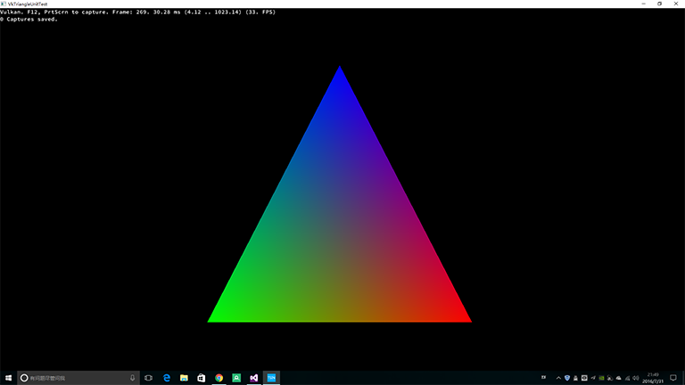

Introduction 
=========


> **Main Feature**
> 
>* `Next Generation Graphics Library` 
>* Modern C++ Code (**`C++ 11`**)
>* Modern Graphics Renderer (`Metal`, `Vulkan`, `Direct3D 12`)
>* **`Maya`** Digital Content Creation Tools
>* **Task-Oriented**, support `multi-thread` rendering 
>* Support Windows, Android, iOS, MacOS & Linux.

----------

Prerequisites
=========

> **Windows:** [](https://ci.appveyor.com/project/TsinStudio/kaleido3d)
> 
>* [CMake 3.4 or later][1]
>* Visual Studio **2015** or later
>* [ThirdParty][8] `Git mirror on Github`
>* Win10


> **Android:** [](https://travis-ci.org/TsinStudio/kaleido3d)
> 
>* Android Studio 2.1 or later.
>* Android SDK N-preview or later.
>* NDK r12 or later.
>* [ThirdParty][8] `Git mirror on Github`


> **MacOS/iOS:**
> 
>* XCode 7 or later.
>* OS X EI Captain or later.


----------

Build Instructions
=========

>* **Windows**: make.bat
>* **Mac OS X**: make.command
>* **Android**: cd Project/android && gradle

RHI Threading Model:
=========

``` cpp

RHIDevices[Global Variable]

RHIQueues[Global]

-- PerThreadCode

rhi::PipelineDesc pipelineDesc = {shaders, raster, depthStencil...};
rhi::IPipelineState pState = device->NewPipelineState(pipelineDesc);

rhi::ICommandContext* gfxCmd = CommandContext::Begin(pDevice, pQueue);

		gfxCmd->Begin();
		gfxCmd->SetPipelineLayout(m_pl);
		rhi::Rect rect{ 0,0, (long)m_Viewport->GetWidth(), (long)m_Viewport->GetHeight() };
		gfxCmd->SetRenderTarget(pRT);
		gfxCmd->SetScissorRects(1, &rect);
		gfxCmd->SetViewport(rhi::ViewportDesc(m_Viewport->GetWidth(), m_Viewport->GetHeight()));
		gfxCmd->SetPipelineState(0, m_pPso);
		gfxCmd->SetIndexBuffer(m_TriMesh->IBO());
		gfxCmd->SetVertexBuffer(0, m_TriMesh->VBO());
		gfxCmd->DrawIndexedInstanced(rhi::DrawIndexedInstancedParam(3, 1));
		gfxCmd->EndRendering();
		gfxCmd->TransitionResourceBarrier(pRT->GetBackBuffer(), rhi::ERS_RenderTarget, rhi::ERS_Present);
		gfxCmd->End();
		
gfxCmd->FlushAndWait();

--

swapChain.Present(pQueue, pImage, pWindow[, semaphore])


```

Current Status
========

- RHI(Render Hardware Interface)

	* [x] Vulkan backend **ready**.
	* [ ] DirectX 12 backend **WIP**
	* [ ] Metal backend **WIP**

- Core.Platform

	* [x] Windows implementation ready.
	* [ ] Android's **still buggy**.
	* [ ] iOS/MacOS not initialized.

- Tools
	
	* [x] HLSL ShaderCompiler (D3DCompiler & GLSLANG)
	* [x] Maya exporter.

- Planned Samples
	
	* [x] Triangle(vk)
	* [ ] Textured Cube 
	* [ ] Shadow Mapping
	* [ ] Physically Based Shading
	* [ ] Deferred Shading
	* [ ] Multi-thread Rendering
	* [ ] Multi-GPU/CrossAdapter Rendering

---

Directories
=========

* **Source:** 
	* ***Core***   
		* *A Cross Platform Implementation Of `IO`, `SIMD` Math, Image And Thread*  
	* ***RHI***   
		* Implementation Include **D3D12**, **Vulkan** And `Metal` API
	* ***Render***
		* providing object-level rendering interfaces.
	* **Engine**
	* **Launcher**
	* **Physics**    
	* [**ThirdParty**][8]
		*  [PhysX 3.3.1][2]
		*  [rapidJson][3]
		*  [ProtoBuf][5]
		*  [Intel Thread Building Blocks][6]
		*  [glslang][7]
		*  LuaJIT
		*  spir2cross
		*  DXSDK
* **Include**
	*  Interface
	*  SIMD Math Library
	*  Template Library


> Note: This project is under MIT License.
	
----------

Samples
=======

## 1.Triangle



---

Contact
=========
> If you have any suggestion, please contact me via [**sina weibo**](http://weibo.com/tsinstudio) or [**email**](mailto:dsotsen@gmail.com). 

Discuss [](https://gitter.im/TsinStudio/kaleido3d?utm_source=badge&utm_medium=badge&utm_campaign=pr-badge&utm_content=badge)
=========


Please join the [gitter chat](https://gitter.im/TsinStudio/kaleido3d) to discuss on this project.
Framework development discussions and thorough bug reports are collected on [Issues](https://github.com/TsinStudio/kaleido3d/issues).


[1]: http://www.cmake.org
[2]: https://developer.nvidia.com/gameworksdownload
[3]: https://github.com/miloyip/rapidjson
[4]: https://code.csdn.net/tomicyo/kaleido3d_dep
[5]: https://github.com/google/protobuf
[6]: https://www.threadingbuildingblocks.org/
[7]: https://github.com/KhronosGroup/glslang
[8]: https://github.com/Tomicyo/kaleido3d_dep
[9]: https://vulkan.lunarg.com/
