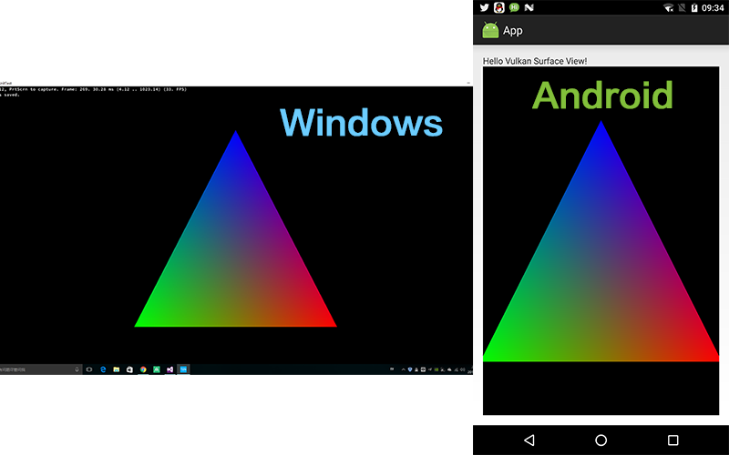
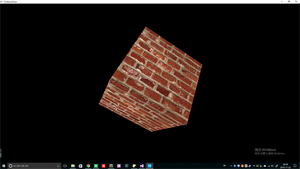
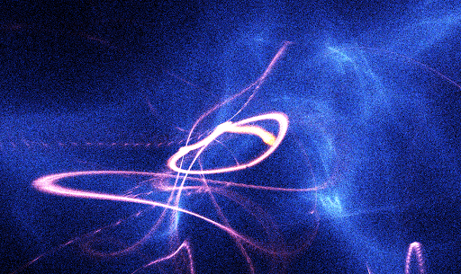

# Kaleido3D

## Introduction

**Kaleido3D** is a cross-platform graphics library, which provides:

>* Next-Gen Graphics API Agnostic Layer (**NGFX**) for `Metal`, `Vulkan` and `DX12`
>* Multi-Threaded Rendering 
>* GLTF as Internal Mesh Format
>* Experimental Real Time Ray-tracing Support (DXR/RTXVK)

> **NOTE**:  This project is heavily under development currently.

----------

## Requirements

* [**Iris Build System**][14]
* Python 2.7 (x64)
* Visual Studio 2017+
* iOS Build Environment (Build iOS App on Windows)
* NDK 14+
* Xcode 8+

---

## Wiki

[See Wikis](https://github.com/kaleido3d/kaleido3d/wiki)

> Currently, NGFX headers and sources are generated by an C++11-like IDL compiler (inside [iris build][14] toolbox)

> See the differences of NGFX implementation across graphics backends [here](docs/ApiDifferences.md).

---

## Unit Tests

### 1.Triangle(Basic)

### 2.TexturedCube(Basic)

### 3.Compute Particles(Intermediate)

---

Contact
=========

If you have any suggestion, please contact me via [**email**][12] or join the [QQ Group][13] to discuss on this project.
Framework development discussions and thorough bug reports are collected on [Issues][4].

---

Credits
=====

**ThirdParty Libraries:**

* ZLib (Core)
* [VOLK (Meta loader for Vulkan API )][15]
* Vulkan Memory Allocator (NGFX)
* Glslang (ShaderCompiler)
* SPIRV-CROSS (ShaderCompiler)
* SPIRV-TOOLS (ShaderCompiler)
* LLVM (Reflection)
* Clang (Reflection)
* GoogleV8 (Script)
* GoogleTest (Unit Test)
* imobiledevice (MobileDevice)

[1]: http://www.cmake.org
[2]: https://developer.nvidia.com/gameworksdownload
[3]: https://github.com/Tencent/rapidjson
[4]: https://github.com/kaleido3d/kaleido3d/issues
[5]: https://github.com/google/protobuf
[6]: https://www.threadingbuildingblocks.org/
[7]: https://github.com/KhronosGroup/glslang
[9]: https://vulkan.lunarg.com/
[10]: https://github.com/KhronosGroup/SPIRV-Cross
[11]: https://www.freetype.org
[12]: mailto:dsotsen@gmail.com
[13]: https://jq.qq.com/?_wv=1027&k=45tL869
[14]: https://github.com/kaleido3d/IrisBuild
[15]: https://github.com/zeux/volk
