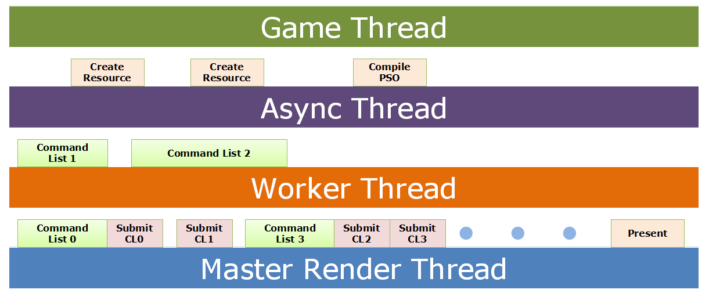

Introduction
=========

> **Main Feature**
> 
>* `Next Generation Graphics Library` 
>* Modern C++ Code (**`C++ 11`**)
>* Modern Graphics Renderer (`Metal`, `Vulkan`, `Direct3D 12`)
>* **`Maya`** Digital Content Creation Tools
>* **Task-Oriented**, support `multi-thread` rendering 

----------

Build Required
=========

> **Compiler Required:**
> 
>* [CMake 2.8+][1]
>* Visual Studio **2013** Update 3 +
>* Clang 3.4 +
>* G++ 4.8 +
>* [ThirdParty][4]

> **Platform Required:**
> 
>* Win10 10130 or OS X EI Capitan

----------

Build Documents:
=========
    cd Document and run makedoc.bat

----------

Build Instructions:
=========

>* **Windows**: make.bat
>* **Mac OS X**: make.command

Directories:
=========

* **Source:** 
	* ***Core***   
		* *A Cross Platform Implementation Of `IO`, `SIMD` Math, Image And Thread*  
	* ***Renderer***   
		* Implementation Include **D3D12** And `Metal` API
	* **Engine**
	* **Launcher**
	* **Physics**    
* **ThirdParty**
	*  GLEW
	*  [PhysX 3.3.1][2]
	*  SDL2.0.3
	*  [rapidJson][3]
	*  [ProtoBuf][5]
    *  [Intel Thread Building Blocks][6]
* **Include**
	*  Interface
	*  SIMD Math Library
	* Template Library

> Note: This project is under MIT License.
	
----------

Contact
=========
> If you have any suggestion, please contact me via [**sina weibo**](http://weibo.com/tsinstudio) or [**email**](mailto:dsotsen@gmail.com). 

Discuss
=========

Please join the [gitter chat](https://gitter.im/TsinStudio/kaleido3d) to discuss on this project.
Framework development discussions and thorough bug reports are collected on [Issues](https://github.com/TsinStudio/kaleido3d/issues).

Reference
=========

1. [Microsoft's MiniEngine Demo][7]
2. [GongMinMin's KlayGE][8]

[1]: http://www.cmake.org
[2]: https://developer.nvidia.com/gameworksdownload
[3]: https://github.com/miloyip/rapidjson
[4]: http://pan.baidu.com/s/1bnk8egJ
[5]: https://github.com/google/protobuf
[6]: https://www.threadingbuildingblocks.org/
[7]: https://github.com/Microsoft/DirectX-Graphics-Samples/tree/feature_miniengine
[8]: https://github.com/gongminmin/KlayGE
