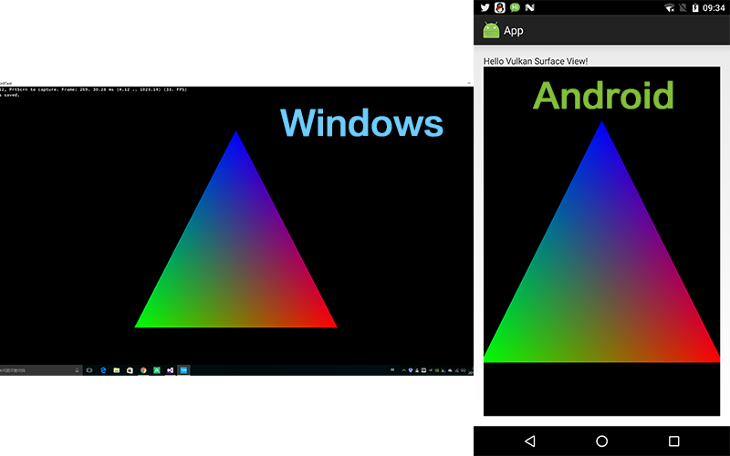
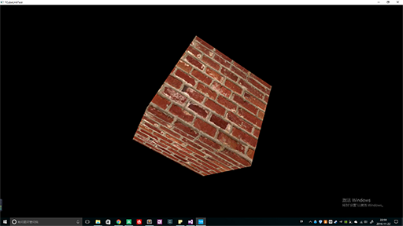
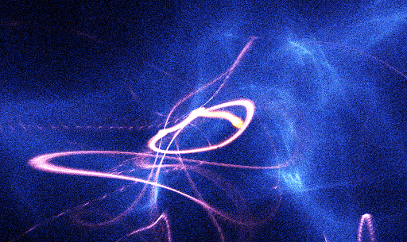

# Kaleido3D

## Introduction

**Kaleido3D** is a cross-platform graphics library, which provides:

>* Next-Gen Graphics API Agnostic Layer (**NGFX**) for `Metal`, `Vulkan` and `DX12`
>* Multi-Threaded Rendering 
>* GLTF as Internal Mesh Format
>* Experimental Real Time Ray-tracing Support (DXR/RTXVK)

> **NOTE**:  This project is heavily under development currently.

----------

## Requirements

* [**Iris Build System**][14]
* Python 2.7 (x64)
* Visual Studio 2017+
* iOS Build Environment (Build iOS App on Windows)
* NDK 14+
* Xcode 8+

---

## Features

- Unity3D ShaderLab parser located in `src/NGFX/Private/ShaderLab`
- D3D12 & Vulkan graphics backend for NGFX (new) `src/NGFX/D3D12` & `src/NGFX/Vulkan`
- Ray tracing
- Old-style RHI with vulkan backend in `src/RHI` 

---

## Repository Layout

### Top-level directories

- `.github/`: GitHub workflows and repository automation.
- `.vscode/`: Workspace settings for local development.
- `build/`: Generated build trees, intermediate files, and platform-specific outputs.
- `dev/`: Developer-facing tools, editors, project generators, and experimental utilities.
- `docs/`: Design notes, API difference documents, screenshots, diagrams, and static site assets.
- `scripts/`: Shared helper scripts, mainly CMake modules and build utilities.
- `src/`: Main source tree for the engine, rendering stack, platform code, and supporting modules.

### Major modules under `src/`

- `src/Core/`: Foundational runtime layer, including containers, math, threading, reflection/runtime helpers, networking utilities, and cross-platform abstractions.
- `src/Engine/`: High-level engine systems such as scenes, cameras, materials, asset loading, render resource management, and gameplay-facing engine context.
- `src/Entity/`: Scene/entity definitions for lights, terrain, sky, vehicles, water, and other world objects.
- `src/Launcher/`: Application entry point used to bootstrap the engine/runtime.
- `src/Log/`: Logging interfaces and implementation.
- `src/Metal/`: Metal-related tooling and translation code, including shader conversion (metal binary ir to vulkan spirv) and backend support utilities.
- `src/Network/`: Networking and HTTP module implementations with unit tests.
- `src/NGFX/`: The **newer** graphics abstraction layer, including public headers, backend implementations, generated IDL interfaces, tests, and samples.
- `src/NGFX_rust/`: Rust experiments and bindings around NGFX concepts.
- `src/Physics/`: Physics integration and vehicle-related helpers.
- `src/Platform/`: Platform-specific application, window, and input code for Android, Apple platforms, Linux, and Microsoft platforms.
- `src/Render/`: Experimental software-rendering components.
- `src/Renderer/`: Higher-level renderer implementation built on top of the rendering abstractions.
- `src/RHI/`: Older rendering hardware interface and backend-specific implementations such as D3D12, Vulkan, OpenGL, and Metal.
- `src/Script/`: V8-based scripting integration and script-side test applications.
- `src/ShaderCompiler/`: Shader compilation and cross-compilation pipeline for multiple graphics APIs.
- `src/UI/`: UI canvas, layout, text layout, and device-facing UI helpers.

### Developer tooling under `dev/`

- `dev/Android/`: Scripts for generating Android project and Gradle scaffolding.
- `dev/ArtServer/`: Asset-processing utilities related to shaders and textures.
- `dev/CppReflector/`: Reflection/code-generation tooling for C++ types.
- `dev/Editor/`: Editor applications and node/material editing tools.
- `dev/IrisBuild/`: Bundled Iris Build executables and helper scripts used by legacy build/code-generation workflows.
- `dev/MayaDCC/`: Autodesk Maya integration and plugin sources.
- `dev/mixdevice/`: Rust-based device communication tooling for Android/iOS workflows.
- `dev/Mobile/`: Mobile device bridge and performance-monitoring utilities.
- `dev/ResourceCompiler/`: Resource conversion and compilation tools.
- `dev/VSVisualizer/`: Visual Studio debugger visualizer assets.
- `dev/WebConsole/`: Browser-based web console/debug UI assets.

### Documentation assets under `docs/`

- `docs/images/`: Screenshots, icons, and visual assets referenced by documentation.
- `docs/book/`: Longer-form book-style documentation sources.
- `docs/javascripts/` and `docs/stylesheets/`: Static site assets for the generated documentation pages.

> Note: the repository contains both newer NGFX-based rendering code and older RHI-era modules. Some directories are experimental or preserved for legacy tooling and platform support.

---

## Wiki

[See Wikis](https://github.com/kaleido3d/kaleido3d/wiki)

> Currently, NGFX headers and sources are generated by an C++11-like IDL compiler (inside [iris build][14] toolbox)

> See the differences of NGFX implementation across graphics backends [here](docs/ApiDifferences.md).

---

## Unit Tests

### 1.Triangle(Basic)

### 2.TexturedCube(Basic)

### 3.Compute Particles(Intermediate)

---

Contact
=========

If you have any suggestion, please contact me via [**email**][12] or join the [QQ Group][13]/[Discord][16] to discuss on this project.
Framework development discussions and thorough bug reports are collected on [Issues][4].

---

Credits
=====

**ThirdParty Libraries:**

* ZLib (Core)
* [Robin-Map][8]
* [VOLK (Meta loader for Vulkan API )][15]
* Vulkan Memory Allocator (NGFX)
* Glslang (ShaderCompiler)
* SPIRV-CROSS (ShaderCompiler)
* SPIRV-TOOLS (ShaderCompiler)
* LLVM (Reflection)
* Clang (Reflection)
* GoogleV8 (Script)
* GoogleTest (Unit Test)
* imobiledevice (MobileDevice)

[1]: http://www.cmake.org
[2]: https://developer.nvidia.com/gameworksdownload
[3]: https://github.com/Tencent/rapidjson
[4]: https://github.com/kaleido3d/kaleido3d/issues
[5]: https://github.com/google/protobuf
[6]: https://www.threadingbuildingblocks.org/
[7]: https://github.com/KhronosGroup/glslang
[8]: https://github.com/Tessil/robin-map
[9]: https://vulkan.lunarg.com/
[10]: https://github.com/KhronosGroup/SPIRV-Cross
[11]: https://www.freetype.org
[12]: mailto:dsotsen@gmail.com
[13]: https://jq.qq.com/?_wv=1027&k=45tL869
[14]: https://github.com/kaleido3d/IrisBuild
[15]: https://github.com/zeux/volk
[16]: https://discord.gg/P4dc7JnrwS